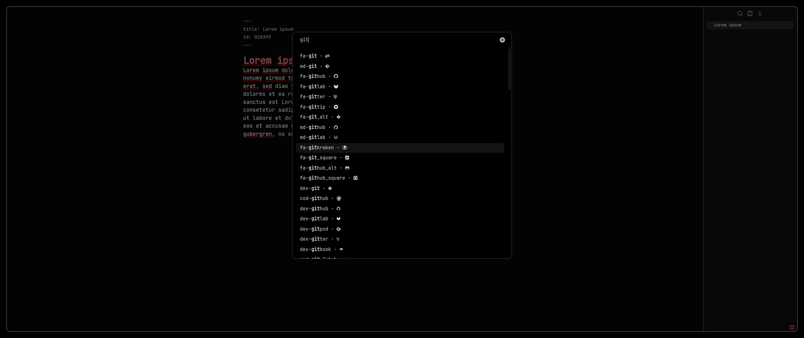

# NerdFont Icon Picker

The **NerdFont Icon Picker** is a plugin for [Obsidian](https://obsidian.md/). It adds an easy-to-use [Nerd Font](https://github.com/ryanoasis/nerd-fonts) icon picker to Obsidian.

## Requirements
- you need a Nerd Font as your text and interface font
### Without plugin
  - install [Nerd Font](https://github.com/ryanoasis/nerd-fonts)
  - go to `Settings > Appeareance > Font`
  - set text and interface font to [Nerd Font](https://github.com/ryanoasis/nerd-fonts)
### With plugin
- I recommend to use the [Custom Font Loader](https://github.com/pourmand1376/obsidian-custom-font) for mobile support
## Installation
### Plugin Store (recommended)
- [search for Nerdfont Icon Picker](https://obsidian.md/plugins?search=NerdFont%20Icon%20Picker) 
### Using BRAT plugin
- use [BRAT](https://github.com/TfTHacker/obsidian42-brat) plugin
### Manual
- download source code from [latest release](https://github.com/xavwe/obsidian-nerdfont-icon-picker/releases/latest)
- unpack it into `path/to/vault/.obsidian/plugins`
## Getting started
- just use command palette or assign hotkey
- have fun ;-)
