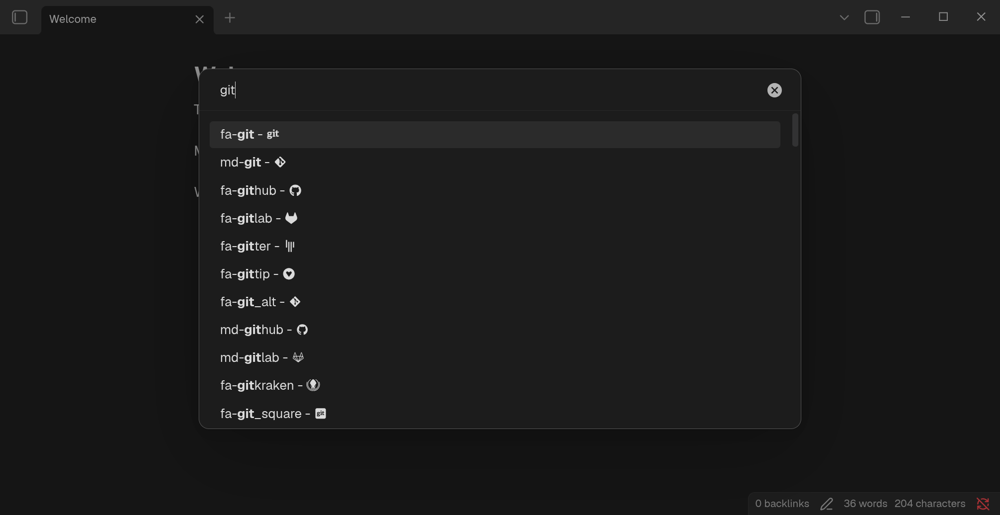

# NerdFont Icon Picker

The **NerdFont Icon Picker** is a plugin for [Obsidian](https://obsidian.md/). It adds an easy-to-use [Nerd Font](https://github.com/ryanoasis/nerd-fonts) icon picker to Obsidian. You can assign a hotkey for quick access.

## Getting Started
1. Install from Obsidian Plugin Store: [NerdFont Icon Picker](https://community.obsidian.md/plugins/nerdfont-icon-picker)
2. Change `Settings > Appearance > Font > Interface Font` and `Settings > Appearance > Font > Text Font` to a NerdFont. Make sure it is installed on you system. For mobile use [Custom Font Loader](https://github.com/pourmand1376/obsidian-custom-font).

## Troubleshooting
- If the icons are not rendered correctly, make sure you have a NerdFont installed and that Obsidian is configured to use it. Note that only Obsidian versions 1.0.3 and later are supported.
- If only some icons are not rendered properly, the installed version of the used NerdFont might be to old to support those symbols. Try updating your NerdFont to the latest version.
